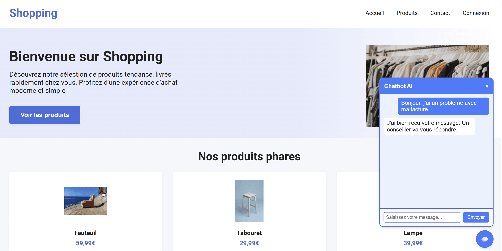

# Chatbot IA

Ce projet est un exemple de site e-commerce avec un chatbot intégré, conçu pour être facilement réutilisable sur n’importe quel site web. Le chatbot est injecté via un script JavaScript autonome et peut être personnalisé avec différents thèmes visuels.

## Aperçu



## Fonctionnalités

- Landing page e-commerce moderne
- Section produits avec cartes visuelles
- Bouton flottant de chat disponible sur toute la page
- Fenêtre de discussion interactive
- Thèmes personnalisables : bleu, rouge, sombre
- Intégration simple via un seul fichier JavaScript
- Compatible avec une utilisation statique sans dépendances externes

## Stack technique

- HTML
- CSS
- JavaScript

## outils 

- Web Browser Preview (plugin VSCODE)

## Comment lancer le projet

1. Cloner le projet `git clone `
2. Se déplaceer dans le projet `cd chatbot_ia`
3. Ouvrir `index.html` dans votre navigateur
4. Le chatbot apparaît automatiquement dans le coin inférieur droit de la page.

## Intégration du chatbot

Le script du chatbot est chargé dans la page HTML avec :

```html
<script src="./chatbot/chatbot.js" theme="blue"></script>
```

### Thèmes disponibles pour personnaliser le Chatbot (ses couleurs)

Le paramètre `theme` accepte plusieurs valeurs :

- `blue`
- `red`
- `dark`

Exemple :

```html
<script src="./chatbot/chatbot.js" theme="dark"></script>
```

## Licence

Ce projet est fourni à titre d’exemple pédagogique.

